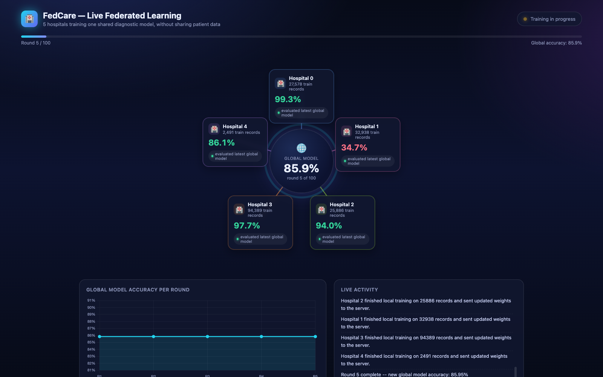

# Live networked demo — for presenting to a panel

Everything in `experiments/` uses Flower's **simulation mode** (all 5 hospitals run inside one Python process, as separate virtual clients — see `PROJECT_GUIDE.md` §5.4-5.5 and `fedcare_project_plan.md`'s "Key implementation decision" for why: it's standard practice in published FL research, and the research question doesn't depend on the transport). That's correct for producing results, but there's nothing to visibly point at in a demo.

This folder is a separate, faithful **presentation layer**: the exact same model and training code (`fl/client.py`, `models/mlp.py`), but running as real, separate OS processes that talk over an actual network socket (gRPC). You can run one terminal per hospital, watch live logs of each hospital training on its own data and sending weights (not data) to a central server, and — if asked — literally open each hospital's data file and show it contains different, non-overlapping patient records.

**Nothing here changes the research results.** This is presentation infrastructure only; `paper/report.md`'s numbers all come from `experiments/`, not from this folder.

## One-time setup

```bash
source .venv/bin/activate
python demo/prepare_demo_data.py
```

This materializes 5 separate files under `demo/hospital_data/` (gitignored — regenerate anytime): `hospital_0_train.npz` ... `hospital_4_train.npz` (+ matching `_val.npz`), each containing only that hospital's own rows. Run this once before a demo; you don't need to re-run it between demo runs unless you want a different `alpha`/hospital count (edit the constants at the top of the script).

**If a panel member asks "did you literally split the data into separate files?"** — yes: show them `demo/hospital_data/` in a file browser, and note the sizes differ (hospital 3 has ~94k records, hospital 4 has ~2.5k — visibly non-identical, matching the non-IID story in `results/eda_dirichlet_partition.png`).

## Running the demo

You need **6 terminals**: 1 for the central server, 5 for hospitals. (All on one machine is fine for a demo; see "Running across multiple machines" below if you want it even more visually convincing.)

**Terminal 1 — the central server:**
```bash
source .venv/bin/activate
python demo/run_server.py --rounds 10
```
It'll print the address and the exact commands to paste into the other 5 terminals.

**Terminals 2-6 — one per hospital:**
```bash
source .venv/bin/activate
python demo/run_hospital.py --hospital-id 0   # then 1, 2, 3, 4 in the other terminals
```

Start the server first, then the 5 hospitals (order among the hospitals doesn't matter). Once all 5 have connected, training starts automatically and you'll see, live:

- Each hospital terminal: `"[Hospital 3] Training locally on my 94389 patient records -- this data never leaves this process."` → `"...sending updated model WEIGHTS (not data) back to the server."`
- The server terminal: a per-round summary of every hospital's local accuracy, then the new aggregated global model's accuracy.

After `--rounds` rounds (default 10), everything exits cleanly on its own.

## Watching it: the live dashboard (recommended for presenting)

`run_server.py` also starts a small local web server showing a live visual dashboard — open **http://localhost:8090** in a browser once the server is running (works before the hospitals connect too; it'll just show 5 hospitals "waiting to connect").


*Preview from an actual run (round 5/100) — every number here is real, live state from the server, not staged. Hospital 1's accuracy showing red/34.7% is the same collapsed-accuracy finding documented in `paper/report.md`.*

It shows, updating in real time as the real demo runs:
- A central "Global Model" node with 5 hospital nodes around it, connected lines that light up when a hospital sends weights
- Each hospital's own record count and local accuracy, color-coded
- A line chart of the global model's accuracy climbing round by round
- A live scrolling activity log (the same events as the terminal, styled for a screen)

This is **read-only** — it displays `demo/dashboard/dashboard_state.json`, which `run_server.py` writes after every round from the real aggregation callback. It cannot influence training and shows nothing that isn't also visible in the terminal logs; it's just much better to project on a screen. Put this on the projector/shared screen instead of a terminal window.

To disable it (e.g. running headless on a server with no browser): `python demo/run_server.py --no-dashboard`. To use a different port if 8090 is taken: `--dashboard-port 8091`.

**One thing worth knowing before you present it**: in this project's `alpha=0.5` non-IID setup, hospital 1's accuracy typically stays flat around 34-35% every round (color-coded red on the dashboard) — that's not a dashboard bug, it's the real, documented finding from `paper/report.md` (vanilla FedAvg collapses that hospital to majority-class prediction). If a panel member asks, that's your cue to talk about the FedProx investigation.

## Running across multiple machines (more visually convincing, more setup risk)

Same code, different `--address`/`--server` values:

1. On the server machine, find its LAN IP (`ipconfig getifaddr en0` on macOS) — say `192.168.1.10`.
2. `python demo/run_server.py --address 0.0.0.0:8080` on that machine.
3. On each hospital's machine: `python demo/run_hospital.py --hospital-id 0 --server 192.168.1.10:8080` (each machine also needs the repo + `.venv` set up, and `demo/hospital_data/` copied over — or just run `prepare_demo_data.py` on each, since it's deterministic and produces identical files everywhere).
4. Make sure the server machine's firewall allows inbound connections on the port you chose.

Recommendation: **rehearse this at least once before presenting** — multi-machine networking is the one part of this demo that can fail for reasons outside your code (firewalls, Wi-Fi vs LAN, VPNs). The single-machine, multi-terminal version is materially safer for a live panel and still fully proves the point (real separate processes, real sockets, real weight-only transmission — `127.0.0.1` is still a real network interface, not a simulation).

## Troubleshooting

- **`Port in server address ... is already in use`**: a previous run didn't shut down cleanly.
  ```bash
  lsof -ti:8080 | xargs kill -9
  ```
- **A hospital terminal hangs at "Connecting to central server..."**: the server hasn't started yet, or `min_available_clients` (5, hardcoded to match 5 hospitals) hasn't been reached — check all 5 hospital terminals are running and pointed at the right address/port.
- **Deprecation warnings from Flower** (`start_server()` / `start_client()` is deprecated): expected, harmless — see `PROJECT_GUIDE.md` §6 for why this API was chosen over Flower's newer `ServerApp`/`flower-superlink` architecture (simpler to reason about, same reasoning as the simulation-mode pin).

## What to say about this in the presentation

- *"Each hospital is a separate process — here they're 5 terminals on my laptop, but the exact same code runs unmodified across 5 separate physical machines on a hospital network, or 5 Docker containers in a production deployment."*
- *"You can see each hospital only trains on its own file — hospital 3 has ~94,000 records, hospital 4 has ~2,500 — and only ever sends model weights over the socket, never the underlying patient data."*
- *"The research results in the paper come from running this same logic hundreds of times faster in Flower's simulation mode — this networked version is slower but makes the architecture visible."*
- *"The dashboard is just a live view of the real server's state — it's reading the same JSON the terminal is printing, rendered nicer for the screen."*

## Rehearse before you present

Run through the whole thing once — `prepare_demo_data.py`, server, all 5 hospitals, dashboard open in a browser — before doing it live. Terminal count and window management (7 windows: 1 server, 5 hospitals, 1 browser) is the main thing that trips people up in the moment, not the code.
