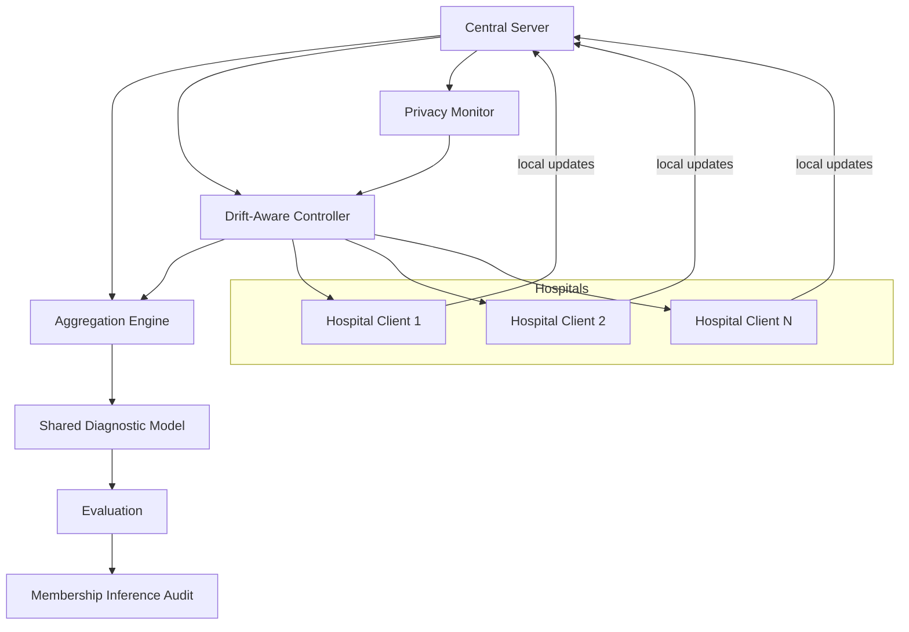

# FedCare Master Project Guide

## 1. Project Title

**Training Shared Diagnostic Models on Distributed Hospital Data Without Data Exposure**

Short project name: **FedCare**

## 2. One-Line Summary

FedCare is a privacy-preserving federated learning system for healthcare diagnostics where multiple hospitals collaboratively train a shared model without sending raw patient data to a central server, while also handling non-IID hospital data, measuring privacy leakage, and adapting to drift using a small controller-based mechanism.

## 3. What the Project Is About

The project builds a simulated multi-hospital federated learning pipeline. Each hospital keeps its patient data locally, trains a local model, and shares only model updates. A central server aggregates those updates to learn a better shared diagnostic model.

The project is not only about training a model. It is about answering a real healthcare question:

How can hospitals learn together from distributed data, without exposing patient records, while still maintaining good diagnostic performance under non-IID data and privacy risk?

## 4. The Real-World Problem

Healthcare data is sensitive, regulated, and difficult to centralize. Hospitals cannot freely pool patient records because of privacy laws, ethics, and institutional barriers.

At the same time, one hospital alone often does not have enough diverse data to train a strong diagnostic model, especially when:

- the dataset is small,
- the disease distribution is uneven,
- different hospitals see different patient populations,
- and medical data changes over time.

This creates two big problems:

1. **Data cannot be centrally shared.**
2. **Local hospital data is not identical across sites.**

So the project solves a practical healthcare AI problem: how to collaborate across hospitals without moving raw data.

## 5. How We Are Solving It

The core method is federated learning.

### Core pipeline

- Each hospital is treated as a client.
- Each client trains locally on its own shard of data.
- The server receives only model updates.
- The server aggregates those updates into a shared global model.
- The system compares centralized, local, and federated training.

### Main technical components

- **Federated averaging** as the baseline collaborative method.
- **FedProx-style personalization** to handle non-IID hospital data.
- **Differential privacy** to reduce leakage from model updates.
- **Membership inference auditing** to test whether privacy is actually preserved.
- **A small drift-aware controller** to make the pipeline more patent-like and more realistic.

## 6. Selected New Idea / Small Angle

The new angle we selected is:

### Drift-aware federated training controller

This controller monitors each hospital’s update drift and leakage risk during training, then dynamically adjusts:

- personalization strength,
- aggregation weight,
- and privacy protection.

This is important because hospitals do not stay identical forever. Data distribution can shift due to:

- changing patient demographics,
- changing equipment,
- changing reporting style,
- changing disease prevalence,
- or protocol changes.

The controller makes the system more adaptive without changing the main project title or drifting away from the original healthcare FL theme.

### Why this angle matters

Most existing papers treat personalization, privacy, and drift separately. Our project frames them as a small closed-loop control problem inside the same diagnostic FL system.

That makes the project more interesting for review and more defensible as a system-level contribution.

## 7. Existing Gaps in the Research

Recent papers show progress, but they still leave several unresolved gaps:

### Gap 1: No closed-loop control of personalization and privacy

Recent healthcare FL papers improve utility or privacy, but most do not dynamically adjust training behavior based on drift or leakage risk.

### Gap 2: Non-IID hospital data is still a major issue

Hospitals often have different patient distributions, but many FL methods still assume static or weakly heterogeneous settings.

### Gap 3: Privacy is often measured theoretically, not empirically

Many projects claim privacy because they use DP, but they do not test leakage directly with attacks such as membership inference.

### Gap 4: Private calibration and drift handling are still underexplored

In healthcare, a model must not only be accurate, but also well-calibrated and robust to distribution change.

### Gap 5: Real-world validation is still limited

Several recent papers use synthetic or benchmark-only experiments and explicitly call for real multicenter validation.

## 8. Literature Review: Recent Papers to Cite

The following papers are the most relevant for a recent literature review. The emphasis is on 2024–2026 papers, with a 2026 base paper.

### Base paper

**Recovering Clinical Utility Under Differential Privacy: Empirical Validation of Adaptive Federated Aggregation on Heterogeneous Cardiovascular Datasets (2026)**

- Best base paper for this project.
- Shows that adaptive aggregation can recover utility under DP on real heterogeneous healthcare data.
- Helps support the idea that fixed FL behavior is not enough.

### Supporting papers

**Federated continual learning: A comprehensive survey on lifelong and privacy-preserving learning over distributed and non-stationary data (2026)**

- Strong support for the drift angle.
- Explicitly identifies unresolved issues such as temporal drift, extreme heterogeneity, and privacy-preserving memory.

**Privacy-Preserving Federated Learning via Differential Privacy and Homomorphic Encryption for Cardiovascular Disease Risk Modeling (2026)**

- Useful for comparing privacy mechanisms.
- Shows that DP and HE are still studied as separate privacy add-ons.

**Privacy-Preserving Federated Learning with Verifiable Fairness Guarantees (2026)**

- Useful as a system-level guarantee paper.
- Shows the field is moving toward stronger verified properties, but not your exact drift-aware controller.

**Privacy-Preserving Decentralized Federated Learning via Explainable Adaptive Differential Privacy (2025)**

- Strong support for adaptive privacy, not static privacy.
- Helps justify changing privacy settings instead of using one fixed noise level.

**Private Federated Multiclass Post-hoc Calibration (2025)**

- Useful if you want to mention reliability of predictions.
- Shows federated private calibration is still underexplored.

**Local Differential Privacy for Federated Learning with Fixed Memory Usage and Per-Client Privacy (2025)**

- Supports per-client privacy handling.
- Useful for arguing that privacy should not be treated as one global constant.

**Membership Inference Attacks and Defenses in Federated Learning: A Survey (2024)**

- Best survey for the privacy leakage section.
- Shows that MIA remains a central threat in FL.

**Private Data Leakage in Federated Human Activity Recognition for Wearable Healthcare Devices (2024)**

- Strong empirical evidence that FL can still leak data.
- Good support for why auditing matters.

**Addressing Data Heterogeneity in Federated Learning of Cox Proportional Hazards Models (2024)**

- Good healthcare heterogeneity reference.
- Supports the claim that non-IID data is still a core difficulty.

**Open Challenges and Opportunities in Federated Foundation Models Towards Biomedical Healthcare (2024)**

- Useful broad survey paper.
- Helps show that biomedical FL still has scale, diversity, and communication challenges.

### How to describe the base paper differently in your review

You can describe the 2026 base paper like this:

> This paper demonstrates that adaptive server-side aggregation can recover diagnostic utility under differential privacy on heterogeneous cardiovascular datasets, suggesting that federated healthcare models should not use a fixed training policy when hospitals differ significantly.

That wording is better for review than simply restating the title.

## 9. Literature Review Gaps We Will Claim

These are the most defensible gaps for the project:

1. **No existing work closes the loop between client drift, personalization, and privacy control.**
2. **Most works audit privacy after training instead of using leakage risk as a training signal.**
3. **Most healthcare FL systems do not adapt their aggregation behavior online when distribution shift appears.**
4. **Private calibration and per-client privacy adaptation remain weakly solved.**
5. **Real multicenter validation is still limited compared to synthetic benchmarks.**

## 10. Novelty Statement

FedCare is novel because it is not only a standard federated learning demo. The system combines:

- distributed hospital training,
- non-IID client simulation,
- privacy-preserving learning,
- empirical leakage auditing,
- and a drift-aware controller that adapts training behavior.

The inventive part is the controller-based adaptation of aggregation, personalization, and privacy, rather than just using known methods independently.

## 11. System Architecture

### Architecture explanation

- Hospitals never share raw data.
- The server coordinates learning.
- The controller monitors drift and leakage signals.
- The aggregation engine combines client updates.
- The evaluation module checks utility and privacy.

## 12. Tech Stack

### Core stack

- Python
- PyTorch
- Flower for federated learning simulation
- Opacus for differential privacy
- scikit-learn for evaluation
- pandas and numpy for preprocessing
- matplotlib / seaborn for plots

### Optional or supportive tools

- Jupyter notebooks for EDA and plots
- LaTeX or Markdown for report drafting
- GitHub for version control

### Why this stack

This stack is practical for a student project, works on free-tier compute, and is enough to build a meaningful healthcare FL prototype without overengineering the system.

## 13. Model and Data Plan

### Planned data

- Primary required dataset: **CDC Diabetes Health Indicators** (BRFSS 2015 tabular dataset).
- Optional secondary dataset for a small validation or stretch-goal branch: **PneumoniaMNIST** from MedMNIST.
- Optional tiny sanity-check dataset if needed for quick debugging: **UCI Heart Disease** / Cleveland Heart Disease.

### Dataset inventory and sources

| Dataset | Purpose | Source | Why it fits |
|---|---|---|---|
| CDC Diabetes Health Indicators | Main healthcare diagnostic FL dataset | UCI / Kaggle mirrors of BRFSS 2015 | Free, tabular, realistic, and small enough to fit easily in storage |
| PneumoniaMNIST | Optional stretch-goal imaging task | MedMNIST package / official MedMNIST repo | Free and lightweight, good if we want a second modality without large storage cost |
| UCI Heart Disease / Cleveland Heart Disease | Optional quick sanity-check dataset | UCI Machine Learning Repository | Very small, useful for debugging or rapid baseline checks |

### What we will use and what we will avoid

- We will use **free public datasets only**.
- We will avoid datasets that require hospital credentials or paid access.
- We will avoid very large datasets that exceed our storage and compute limits.
- We will avoid anything in the 15-20 GB range.
- We will keep the project centered on one main tabular dataset so the pipeline stays manageable.

### Why tabular first

- Faster to train.
- Easier to debug.
- Better for free-tier compute.
- Good enough to prove the federated privacy and personalization story.

### Why the chosen datasets are enough

The main CDC Diabetes dataset is large enough to simulate multiple hospital clients, but still light enough to download and process easily. The optional PneumoniaMNIST dataset is much smaller than real-world medical imaging corpora and can be added only if time and storage allow. The tiny UCI Heart Disease dataset is kept only as a debugging or sanity-check option, not as the main experimental dataset.

### Data partitioning

- Use Dirichlet-based non-IID partitioning.
- Simulate different hospital populations.
- Visualize class imbalance across clients.

## 14. Build Phases and Roadmap

### Phase 1: Foundations

- Read recent papers.
- Set up the repo and environment.
- Load and clean the dataset.
- Perform EDA.
- Create non-IID client partitions.

### Phase 2: Baseline model

- Train a centralized diagnostic model.
- Train fully local client models.
- Measure baseline accuracy.

### Phase 3: Federated core

- Implement Flower-based client-server training.
- Test vanilla FedAvg.
- Add FedProx-style personalization.
- Compare per-client results.

### Phase 4: Privacy layer

- Add Opacus DP-SGD.
- Check privacy-utility trade-offs.
- Ensure privacy accounting is correct across rounds.

### Phase 5: Privacy auditing

- Implement membership inference attack.
- Evaluate attack AUC and leakage trends.
- Sanity-check on an overfit model first.

### Phase 6: Drift-aware controller

- Detect client drift.
- Adjust personalization and privacy settings dynamically.
- Observe whether the controller improves worst-client performance.

### Phase 7: Final evaluation and report

- Plot utility-vs-privacy trade-offs.
- Plot drift response behavior.
- Write the final report and presentation.

## 15. Plan for the New Drift Angle

The drift-aware controller will be the small added angle that makes the project more interesting without changing the title.

### Proposed behavior

For each hospital client:

- estimate update drift,
- estimate leakage risk,
- and adjust the training policy.

### Possible control actions

- increase personalization when drift rises,
- increase privacy noise when leakage risk rises,
- reduce the influence of unstable clients,
- trigger recalibration when the hospital distribution shifts.

### Why this is useful

This makes the FL system adaptive rather than static. It gives you a better review story and a more patent-like system design.

## 16. What We Will Measure

### Utility metrics

- Accuracy
- F1 score
- AUC
- Worst-client accuracy
- Average client accuracy

### Privacy metrics

- Membership inference attack AUC
- Leakage trend across training rounds
- Privacy-utility trade-off under different epsilon values

### Drift-related metrics

- Client update drift
- Stability of training across rounds
- Improvement after controller action

## 17. Expected Contributions

The final project should contribute:

1. A healthcare FL system that avoids raw data sharing.
2. A comparison of centralized, local, and federated training.
3. A privacy audit using membership inference.
4. A drift-aware controller that adapts training behavior.
5. A review-worthy narrative grounded in recent literature.

## 18. Why This Is Better Than a Plain Tutorial Project

A plain FL tutorial usually stops at FedAvg on a dataset.

FedCare is better because it adds:

- non-IID hospital simulation,
- privacy-preserving learning,
- empirical privacy auditing,
- and a small but meaningful adaptive controller.

That turns the project into a real system problem rather than a generic model-training exercise.

## 19. Risks and Mitigations

### Risk: the controller becomes too complex

Mitigation: keep it lightweight and rule-based.

### Risk: privacy accounting is incorrect

Mitigation: validate the DP setup carefully across rounds.

### Risk: drift angle becomes too broad

Mitigation: keep it small and client-level only.

### Risk: compute becomes too heavy

Mitigation: stay with tabular data and simulation mode.

## 20. Final Review Positioning

In the viva or review, present the project as:

> A privacy-preserving federated healthcare diagnostic system that trains on distributed hospital data without exposing raw records, handles non-IID client variation, audits leakage empirically, and uses a small drift-aware controller to adapt aggregation and personalization.

That is the cleanest and strongest way to explain the project.
